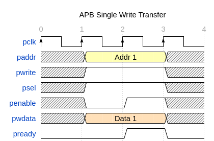
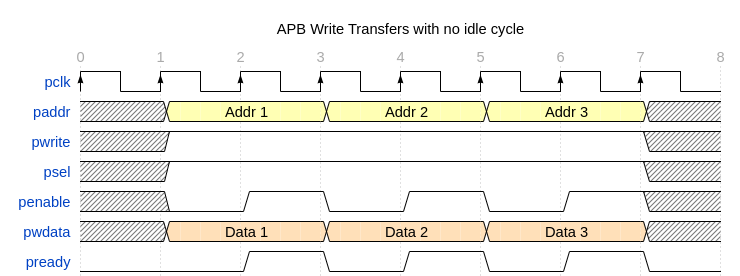
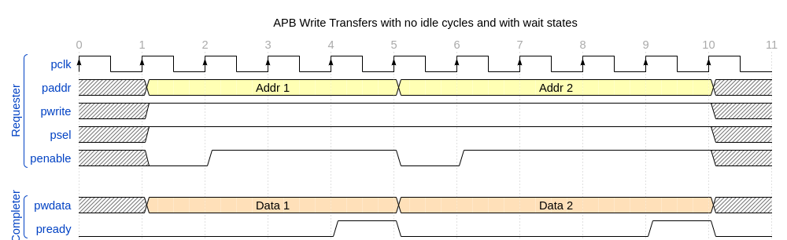
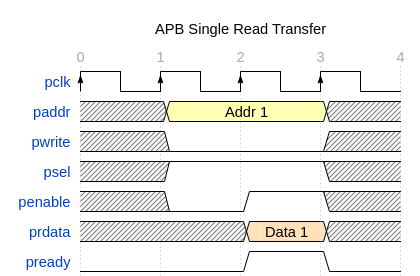

# Advanced Peripheral Bus 3

Advanced Peripheral Bus 3 (APB3) specification can be obtained from the [ARM Developer website](https://developer.arm.com/documentation/ihi0024/latest/)

## Features

Based on "Chapter 3: Transfers", "Chapter 5: Interface parity protection" and "Annex B: Signal list", the following features are required (Yes), not required (No) or optional (Optional) to conform to AMBA APB3 specification.

|              Feature               | Is required in APB3? |
| :--------------------------------: | :------------------: |
| Write transfer with no wait states |         Yes          |
| Read transfer with no wait states  |         Yes          |
| Write transfer with no idle cycles |         Yes          |
| Read transfer with no idle cycles  |         Yes          |
|  Write transfer with wait states   |       Optional       |
|   Read transfer with wait states   |       Optional       |
|           Error response           |       Optional       |
|    Write strobes (byte access)     |          No          |
|      Protection Unit Support       |          No          |
|     Realm Management Extension     |          No          |
|         Wake-up signalling         |          No          |
|          User signalling           |          No          |
|          Parity checking           |          No          |

## Signals

Based on "Annex B: Signal list", the list of signals required in the interface to conform to AMBA APB3 specification is:

    pclk, presetn, paddr, pselx, penable, pwrite, pwdata, prdata

Signals optional for APB3 Completers, but mandatory for APB3 Requesters, needed to support features "transfers with wait states" and "error responses" are:

    pready, pslverr

| Signal  | Is required in APB3? | Is implemented here? |
| :-----: | :------------------: | :------------------: |
|  pclk   |         Yes          |         Yes          |
| presetn |         Yes          |         Yes          |
|  paddr  |         Yes          |         Yes          |
|  pselx  |         Yes          |         Yes          |
| penable |         Yes          |         Yes          |
| pwrite  |         Yes          |         Yes          |
| pwdata  |         Yes          |         Yes          |
| prdata  |         Yes          |         Yes          |
| pready  |       Optional       |         Yes          |
| pslverr |       Optional       |          No          |
|  pprot  |          No          |          No          |
|  pnse   |          No          |          No          |
|  pstrb  |          No          |          No          |
| pwakeup |          No          |          No          |
| pauser  |          No          |          No          |
| pwuser  |          No          |          No          |
| pruser  |          No          |          No          |
| pbuser  |          No          |          No          |
|  p*chk  |          No          |          No          |

## Transfers

### Write transfer with no wait states

As defined in 3.1.1 of the AMPA APB Protocol Specification

### Write transfer with wait states

As defined in 3.1.2 of the AMPA APB Protocol Specification

### Write transfer with wait states and no idle cycles

As defined in 3.1.1 and 3.1.2 of the AMPA APB Protocol Specification

### Read transfer with no wait states

As defined in 3.1.2 of the AMPA APB Protocol Specification

Further examples of read transfers are not provided for brevity - the main difference between read and write transfers is that `pwrite` is driven LOW and `prdata` is used instead of `pwdata`.

# Supported use cases and limitations

Current implementation was tested with a single Requester and a single Completer.

## Renode as Requester

`renode_apb3_requester` is capable of the following features:

|              Feature               | Is implemented here? |
| :--------------------------------: | :------------------: |
| Write transfer with no wait states |         Yes          |
| Read transfer with no wait states  |         Yes          |
| Write transfer with no idle cycles |          No          |
| Read transfer with no idle cycles  |          No          |
|  Write transfer with wait states   |         Yes          |
|   Read transfer with wait states   |         Yes          |
|           Error response           |          No          |
|    Write strobes (byte access)     |          No          |
|      Protection Unit Support       |          No          |
|     Realm Management Extension     |          No          |
|         Wake-up signalling         |          No          |
|          User signalling           |          No          |
|          Parity checking           |          No          |

Limitations:
 - `renode_apb3_requester` is incapable of generating transfers without idle cycles,
 - signal `PSELX` is always 1 bit wide - implementation was only tested in a point to point connection scenario.

## Renode as Completer

`renode_apb3_completer` is capable of the following features:

|              Feature               | Is implemented here? |
| :--------------------------------: | :------------------: |
| Write transfer with no wait states |         Yes          |
| Read transfer with no wait states  |         Yes          |
| Write transfer with no idle cycles |         Yes          |
| Read transfer with no idle cycles  |         Yes          |
|  Write transfer with wait states   |         Yes          |
|   Read transfer with wait states   |         Yes          |
|           Error response           |          No          |
|    Write strobes (byte access)     |          No          |
|      Protection Unit Support       |          No          |
|     Realm Management Extension     |          No          |
|         Wake-up signalling         |          No          |
|          User signalling           |          No          |
|          Parity checking           |          No          |

